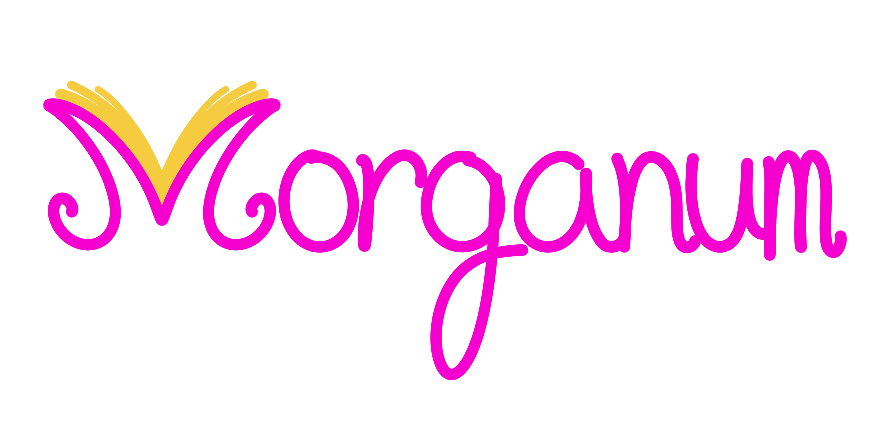

# FataMorgana
Repositório dedicado ao grupo Fata Morgana para confecção de aplicativos ao longo do curso de Ciência da Computação do Centro Universitário UDF.

## Morganum

 Aplicação web simulando um sistema de uma livraria. O sistema será apresentado como trabalho final de três matérias simultaneamente: Estrutura de Dados; Banco de Dados; e Programação Orientada a Objetos.
 ### Features:
 * Sistema de login para clientes e funcionários;
 * Banco de dados com estoque da Livraria, assim como informações de usuários;
 * Sistema CRUD acessível a funcionarios;
 * Histórico de compras para clientes, além de sistema de pontos bonificando clientes com descontos de acordo com valor de suas compras;
 * Barra de busca que lista títulos com base em palavras-chave, nome de autor, gêneros, etc;
